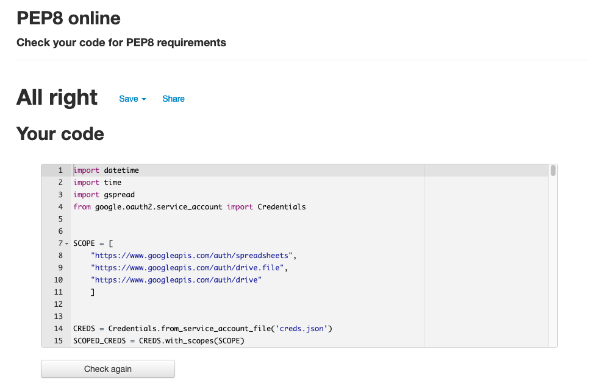
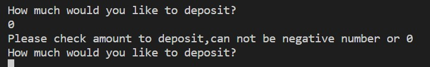
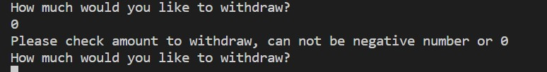
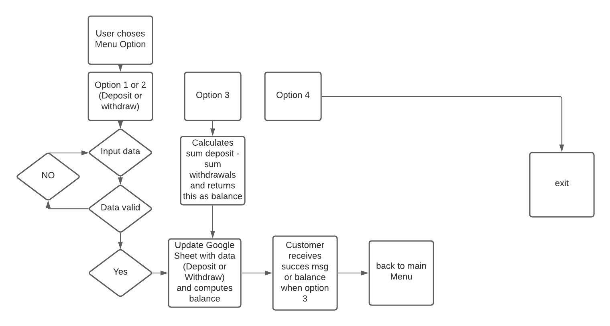

# Portfolio Project 3 - ATM Machine

## Introduction

Welcome to my ATM Machine. ATM Machine is a python based program which runs in a mock terminal on Heroku. 
The program simulates all activaties that can be done with a regular ATM Machine.
Users can Deposit money, Withdraw money and Check their balance.

---

The live version of the project can be found [here](https://portfolio3-atm-machine.herokuapp.com/).

The interface of the ATM maching looks like this:

---
## Operation of the ATM Machine.

When opening up the program, users will be presented with 4 options.

1. Deposit

   This options enables users to deposit money.

2. Withdraw

   This option enables users to withdraw money.

3. Check Balance

   This option enables users to check their current balance

4. Exit

   This option will exit the program and "Eject the card"

The ATM machine consist of a numpad only and users need to enter a Integer and follow the menu as per screen instructions. Empty strings or Alphanumeric values can technically not be entered.
(Have my ATM machine based on how Dutch ATM machines operate and these options are not possible)   

---
## Features

- Input Validation
  - Users can <b>NOT</b> enter negative numbers or numbers that start with 0.
  - ATM Machine <b>Only</b> contains numpad so validation for letters has not been implemented since these can not be entered.
  - At this moment a Negative Balance is allowed.

---
## Future Features

- Add the option to enter client ID and track input against this client ID.
- Add admin panel to create customer profiles and view transactions.
- Admin option to clear balances.
- Add support for a line of credit that will limit the amount a user can withdraw.
- Add Support for AlphaNumeric keyboard.

---
## Testing

 - [PEP8 Online Validator](http://pep8online.com/) This is a PEP8 online validator.

 - Given invalid input: 
  Integers starting with 0 and Negative numbers.

Tested Deposit with input 0 or negative integer.

Tested Withdraw with input 0 or negative integer.

 - Tested all menu options on my local machine and heroku
 - Checked that data is correctly written to Gsheet.
 - Checked that calculation are correctly reflecting in Gsheet.

---

## Bugs

### Solved Bugs
- I collected the inputs as integer and converted this to a string when writing to Gsheet for readability. When pulling the data back in it had to be correctly converted back from string to int. This was tricky because I use a Euro sign (€) within the string.    

### Open Bugs

- None remaining, however I have decided that my ATM only contains a Numpad so support for Alphanumeric values has not been implemented. This has been outlined as a future request.

---

## Validator Testing
- PEP8
  - No errors are returned.

---

## Deployment

- This project was deployed by using Code Institute's template for python.

- Steps for deployment.
  - Fork or clone this repository.
  - Create a new Heroku App.
  - Set the buildbacks to Python and NodeJS in that order.
  - Link the Heroku app to the repository.
  - Click on Deploy.

---

## FlowChart

---
## Other relevant documents

With the below google sheet, transactions can be viewed.
(Have editing not enabled since anyone might be able to edit then)
[google sheet transactions](https://docs.google.com/spreadsheets/d/1DkEs1Aweo1dGsNuYay9qN9XGljwz06iROvdnVPce9Hg/edit?usp=sharing)

## Credits

- Code Institute - Love Sandwiches Project
- Stackoverflow - https://www.stackoverflow.com

  
## Acknowledgements

- I would like to thank my Mentor Gerry McBride for his insights.